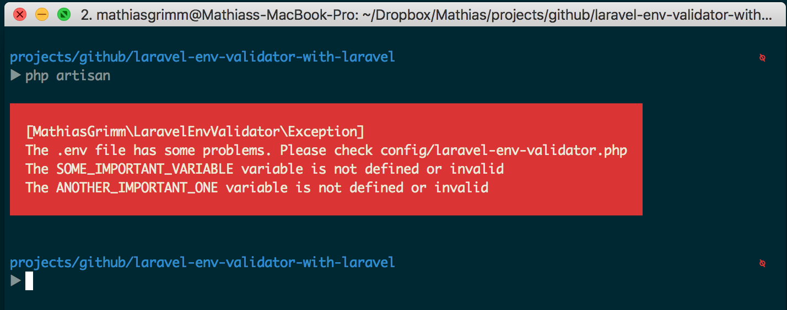

Laravel Env Validator
======

[](https://twitter.com/matgrimm)
[](https://github.com/mathiasgrimm/laravel-env-validator/releases)
[](https://packagist.org/packages/mathiasgrimm/laravel-env-validator)

Laravel Env Validator is meant to validate your .env file in order to avoid any unexpected behaviour for not having properly defined some variable or value. 

### Highlights

- Make sure you don't go live without all required .env variables and without the correct values
- Validate you env variables using the Laravel Validator by simple defining rules in a configuration file
- Working in teams becomes easier

## Installation

Laravel Env Validator is available via Composer:

```json
{
    "require": {
        "mathiasgrimm/laravel-env-validator": "1.*"
    }
}
```

```php
// config/app.php

'providers' => [
    ...
    MathiasGrimm\LaravelEnvValidator\ServiceProvider::class,
    ...
],
```

```
php artisan vendor:publish --provider="MathiasGrimm\LaravelEnvValidator\ServiceProvider" --tag="config"
```

## Example
```php
<?php
// config/laravel-env-validator.php

return [
    'SOME_IMPORTANT_VARIABLE' => 'required',
    'ANOTHER_IMPORTANT_ONE'   => 'required|in:TYPE_A,TYPE_B,TYPE_C',
]

```

## Screenshot



## Security

If you discover any security related issues, please email mathiasgrimm@gmail.com instead of using the issue tracker.

## Credits

- [Mathias Grimm](https://github.com/mathiasgrimm)

